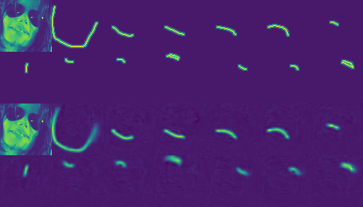
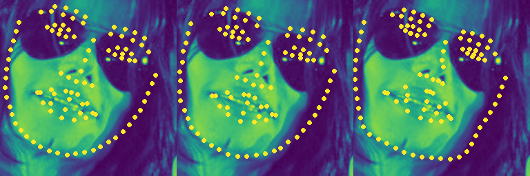
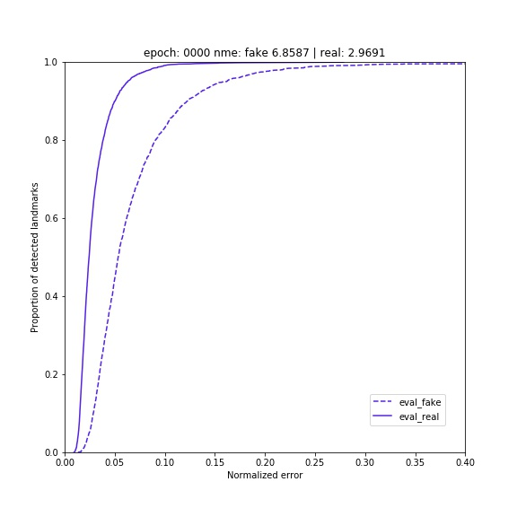

# 人脸关键点

### 实验的自变量：Hourglass的Block, 数据集以及Stage的数量

目前稳定的工作是：4个stage的residual block的hourglass可以正常跑通

## 数据集：
* 用newWflw里的数据增强（在原有时间上每个epoch会增加1min的时间）
* 先保存好了再跑（可能会使网络过拟合，当然可以通过数据集的图片数量解决）

## Train Boundary
* 建议使用循环Lr
* 除了看Loss的变换曲线，更加定性的方式是可视化boundary
* 目前每次200epoch
* 网络head可以加载预训练模型（虽然hekaiming的文章说这样效果上差别不大）

## Train Landmarks
* 已经跑完200epoch单独训练landmarks regressor的代码
* 没有和boundary net一起训练，考虑要不要一起finetune
* 正常姿态的人脸已经基本可以正常输出，但特殊姿态人脸尚不完美，可能是特殊姿态人脸数据较少的原因
* 这里使用SGD(momentum)比较好

## 2019.1.5.更新：
* 卡在boundary上，以及hard example对训练的影响
* 大姿态以及遮挡的结果最差，这些情况下boundary的输出不够好
* loss函数L2对异常值很敏感，L1 loss或Wingloss效果更好
* 人脸轮廓loss比较大，容易受胡子，角度等因素影响
* plan：加强boundary的训练，hard example mining

(fake boundary, real boundary, ground truth.)

## CED curves

